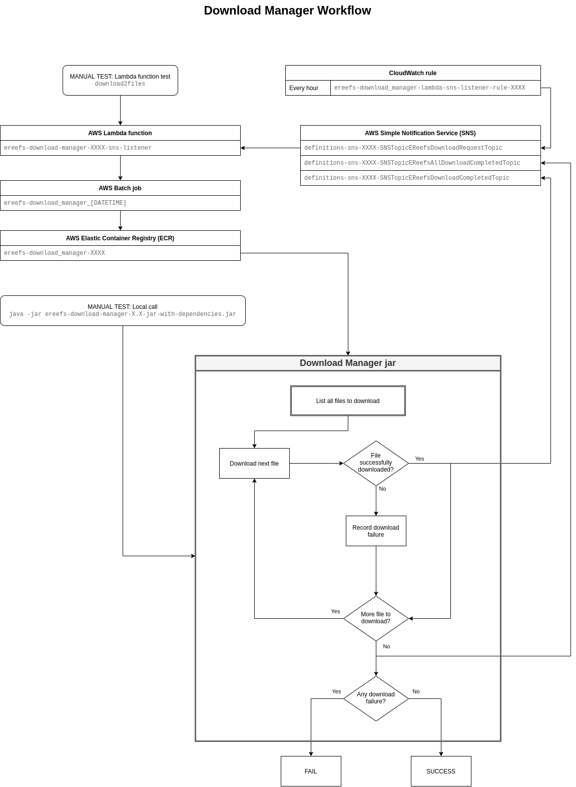

# eReefs Download Manager

The `DownloadManager` is a java `jar` that runs in a Docker container. It is used to download NetCDF files from Thredds
catalogues sources, such as the eReefs NCI server.



Its execution is triggered by AWS `CloudWatch` on regular basis. Once called, it creates a list of file to download
and download them.

It creates the list of files to download as followed:
1. Find every enabled `DownloadDefinition` found in the Database `DOWNLOAD` table,
2. For each of them, download the Thredds XML catalogue to determine available files,
3. Compare the list of available files with the previously downloaded files, as described in the Database `METADATA` table

Each missing / outdated NetCDF file is download as followed:
1. Download the NetCDF file locally,
2. Parse the NetCDF file to extract its metadata,
3. Upload the file to the S3 bucket configured in the `DownloadDefinition`,
4. Saved the extracted metadata to the Database `METADATA` table

## How to compile

1. Checkout `ereefs-database` project
2. Compile and install the project in your local maven repository using: `mvn clean package install`
3. Compile the `ereefs-download-manager` project using: `mvn clean package`
4. To compile and deploy the docker image, see the <a href="docker-scripts/README.md">Docker scripts</a> README file

## Usage ##

1. Add some Thredds Catalogues to the Database `DOWNLOAD` table.

    See project `ereefs-definitions`

2. Verify the execution using the `dryrun` feature:

    ```java -jar ereefs-download-manager-X.X-jar-with-dependencies.jar dryrun```

3. If you are satisfied with the output of the dry run, execute:

    ```java -jar ereefs-download-manager-X.X-jar-with-dependencies.jar```

## AWS Infrastructure ##

This project can be deployed to AWS using Cloud Formation.
The `cloudformation.yaml` file creates the required elements for its deployment to AWS ECR
and for its execution.

### Testing using AWS Lambda function ###

The `cloudformation.yaml` file creates a Lambda function called `ereefs-download-manager-XXXX-sns-listener`
where `XXXX` in the name of the deployment environment.

Navigate to AWS Lambda, locate the function and click it to open its interface.
At the top right, you will see a dropdown and a `Test` button. If there is no test setup,
create one with the following parameters:

**Create new test event**  
Event name: *download2files*
```
{
  "Records": [
    {
      "Sns": {
        "Message": "{ \"limit\": 2, \"dryRun\": false }"
      }
    }
  ]
}
```

If you trigger this test, AWS Lambda will trigger a `AWS Batch job` named `ereefs-download_manager_[DATETIME]`.

Monitor the `AWS Batch job` to see if it succeeds. When the task successfully terminate, 2 new files
are downloaded from each Download definitions and uploaded to S3, along with associated metadata
saved in the database.

### CloudWatch rule ###

The `cloudformation.yaml` file also create a `CloudWatch` rule named `ereefs-download_manager-lambda-sns-listener-rule-XXXX`
where `XXXX` in the name of the deployment environment.

The rule act as a `cron` job. It trigger the download manager periodically
by publishing a SNS message to the `definitions-sns-XXXX-SNSTopicEReefsDownloadRequestTopic` topic.
The Lambda function described above listen to that topic and automatically trigger a new `AWS Batch job`
when a message is published in that topic. The Batch job runs the DownloadManager in a docker container.
When there is new file available, the DownloadManger downloads them then publish a message in
`definitions-sns-XXXX-SNSTopicEReefsDownloadCompletedTopic` topic after each successful downloaded file.
Once all files are downloaded, it publishes a message in
`definitions-sns-XXXX-SNSTopicEReefsAllDownloadCompletedTopic` topic.

If the deployment environment is `PROD`, the rule is set to download all the missing / modified files, every hour.
Otherwise, the rule is set to download only 2 files per download definition and is disabled by default,
to prevent unwanted behaviour on development environments.


### Manually Trigger a Download ###

1. Open the `Amazon SNS` page:  
    Services > Application Integration > Simple Notification Service

2. Open the `download-request_prod` topic

3. Click on `[Publish message]` button, in top right corner

4. Fill the form:  
    Subject: `DownloadManager_2021-02-22_14h42`  
    Message body to send to the endpoint: `{ "limit": -1, "dryRun": false }`  
    Click `[Publish Message]` button, in the bottom right corner of the form.
